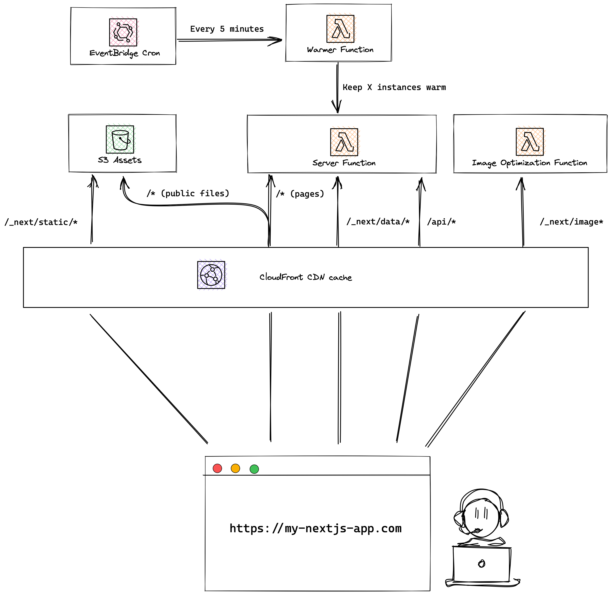

<p align="center">
  <a href="https://open-next.js.org">
    <picture>
      <source media="(prefers-color-scheme: dark)" srcset="docs/public/logo-dark.svg">
      
    </picture>
  </a>
</p>
<p align="center">
  <a href="https://sst.dev/discord"></a>
  <a href="https://www.npmjs.com/package/open-next"></a>
</p>

---

<p align="center">
  <a href="https://open-next.js.org/">Website</a> |
  <a href="#deployment">Deployment</a> |
  <a href="#recommended-infrastructure-on-aws">Infrastructure</a> |
  <a href="#example">Example</a> |
  <a href="#faq">FAQ</a>
</p>

OpenNext takes the Next.js build output and converts it into a package that can be deployed to any functions as a service platform.

## Features

OpenNext aims to support all Next.js 13 features. Some features are work in progress. Please open a [new issue](/issues/new) to let us know!

- [x] App & Pages Router
- [x] API routes
- [x] Dynamic routes
- [x] Static site generation (SSG)
- [x] Server-side rendering (SSR)
- [x] [Incremental static regeneration (ISR)](#how-isr-works)
- [x] Middleware
- [x] Image optimization
- [x] [NextAuth.js](https://next-auth.js.org)
- [x] [Running at edge](#running-at-edge)
- [x] [No cold start](#how-warming-works)

## How does OpenNext work?

When calling `open-next build`, OpenNext **runs `next build`** to build the Next.js app, and then **transforms the build output** to a format that can be deployed to AWS.

#### Building the Next.js app

OpenNext runs the `build` script in your `package.json` file. Depending on the lock file found in the app, the corresponding packager manager will be used. Either `npm run build`, `yarn build`, or `pnpm build` will be run. For more on customizing the build command, see [overriding the build command](#custom-build-command).

#### Transforming the build output

The build output is then transformed into a format that can be deployed to AWS. The transformed output is generated inside the `.open-next` folder within your Next.js app. Files in `assets/` are ready to be uploaded to AWS S3. And the function code is wrapped inside Lambda handlers, ready to be deployed to AWS Lambda or Lambda@Edge.

```bash
my-next-app/
  .open-next/
    cache/                         -> ISR cache files to upload to an S3 Bucket
    assets/                        -> Static files to upload to an S3 Bucket
    server-function/               -> Handler code for server Lambda Function
    revalidation-function/         -> Handler code for revalidation Lambda Function
    image-optimization-function/   -> Handler code for image optimization Lambda Function
    warmer-function/               -> Cron job code to keep server function warm
```

## Deployment

OpenNext allows you to deploy your Next.js apps using a growing list of frameworks.

### SST

The easiest way to deploy OpenNext to AWS is with [SST](https://docs.sst.dev/start/nextjs). This is maintained by the OpenNext team and only requires three simple steps:

1. Run `npx create-sst@latest` in your Next.js app
2. Run `npm install`
3. Deploy to AWS `npx sst deploy`

For more information, check out the SST docs: https://docs.sst.dev/start/nextjs

### Other Frameworks

The OpenNext community has contributed deployment options for a few other frameworks.

- CDK: https://github.com/jetbridge/cdk-nextjs
- CloudFormation: https://github.com/serverless-stack/open-next/issues/32
- Serverless Framework: https://github.com/serverless-stack/open-next/issues/32
- Terraform: https://github.com/RJPearson94/terraform-aws-open-next
- Terraform: https://github.com/nhs-england-tools/terraform-aws-opennext#diagrams

To use these, you'll need to run the following inside your Next.js app.

```bash
$ npx open-next@latest build
```

If you are using OpenNext to deploy using a framework that is not listed here, please let us know so we can add it to the list.

## Recommended infrastructure on AWS

OpenNext does not create the underlying infrastructure. You can create the infrastructure for your app with your preferred tool — SST, AWS CDK, Terraform, Serverless Framework, etc.

This is the recommended setup.

<p align="center">
  
</p>

Here are the recommended configurations for each AWS resource.

#### Asset files

Create an S3 bucket and upload the content in the `.open-next/assets` folder to the root of the bucket. For example, the file `.open-next/assets/favicon.ico` should be uploaded to `/favicon.ico` at the root of the bucket. If you need to upload the files to a subfolder within the bucket, [refer to this section](#reusing-same-bucket-for-asset-and-cache).

There are two types of files in the `.open-next/assets` folder:

**Hashed files**

These are files with a hash component in the file name. Hashed files are be found in the `.open-next/assets/_next` folder, such as `.open-next/assets/_next/static/css/0275f6d90e7ad339.css`. The hash values in the filenames are guaranteed to change when the content of the files is modified. Therefore, hashed files should be cached both at the CDN level and at the browser level. When uploading the hashed files to S3, the recommended cache control setting is

```
public,max-age=31536000,immutable
```

**Un-hashed files**

Other files inside the `.open-next/assets` folder are copied from your app's `public/` folder, such as `.open-next/assets/favicon.ico`. The filename for un-hashed files may remain unchanged when the content is modified. Un-hashed files should be cached at the CDN level, but not at the browser level. When the content of un-hashed files is modified, the CDN cache should be invalidated on deploy. When uploading the un-hashed files to S3, the recommended cache control setting is

```
public,max-age=0,s-maxage=31536000,must-revalidate
```

#### Cache files

Create an S3 bucket and upload the content in the `.open-next/cache` folder to the root of the bucket. If you need to upload the files to a subfolder within the bucket, [refer to this section](#reusing-same-bucket-for-asset-and-cache).

There are two types of caches in the `.open-next/cache` folder:

- Route cache: This cache includes `html` and `json` files that are prerendered during the build. They are used to seed the revalidation cache.
- Fetch cache: This cache includes fetch call responses, which might contain sensitive information. Make sure these files are not publicly accessible.

#### Image optimization function

Create a Lambda function using the code in the `.open-next/image-optimization-function` folder, with the handler `index.mjs`. Also, ensure that the function is configured as follows:

- Set the architecture to `arm64`.
- Set the `BUCKET_NAME` environment variable with the value being the name of the S3 bucket where the original images are stored.
- Set the `BUCKET_KEY_PREFIX` environment variable if the asset files are uploaded to a subfolder in the S3 bucket. The value is the path to the folder. This is Optional.
- Grant `s3:GetObject` permission.

This function handles image optimization requests when the Next.js `<Image>` component is used. The [sharp](https://www.npmjs.com/package/sharp) library, which is bundled with the function, is used to convert the image. The library is compiled against the `arm64` architecture and is intended to run on AWS Lambda Arm/Graviton2 architecture. [Learn about the better cost-performance offered by AWS Graviton2 processors.](https://aws.amazon.com/blogs/aws/aws-lambda-functions-powered-by-aws-graviton2-processor-run-your-functions-on-arm-and-get-up-to-34-better-price-performance/)

Note that the image optimization function responds with the `Cache-Control` header, so the image will be cached both at the CDN level and at the browser level.

#### Server Lambda function

Create a Lambda function using the code in the `.open-next/server-function` folder, with the handler `index.mjs`. Also, ensure that the function is configured as follows:

- Set the `CACHE_BUCKET_NAME` environment variable with the value being the name of the S3 bucket where the cache files are stored.
- Set the `CACHE_BUCKET_KEY_PREFIX` environment variable if the cache files are uploaded to a subfolder in the S3 bucket. The value is the path to the folder. This is optional.
- Set the `CACHE_BUCKET_REGION` environment variable with the value being the region of the S3 bucket.
- Set the `REVALIDATION_QUEUE_URL` environment variable with the value being the URL of the revalidation queue.
- Set the `REVALIDATION_QUEUE_REGION` environment variable with the value being the region of the revalidation queue.
- Grant `s3:GetObject`, `s3:PutObject`, and `s3:ListObjects` permission.
- Grant `sqs:SendMessage` permission.

This function handles all other types of requests from the Next.js app, including Server-side Rendering (SSR) requests and API requests. OpenNext builds the Next.js app in **standalone** mode. The standalone mode generates a `.next` folder containing the **NextServer** class that handles requests and a `node_modules` folder with **all the dependencies** needed to run the `NextServer`. The structure looks like this:

```
  .next/                -> NextServer
  node_modules/         -> dependencies
```

The server function adapter wraps around `NextServer` and exports a handler function that supports the Lambda request and response. The `server-function` bundle looks like this:

```diff
  .next/                -> NextServer
+ .open-next/
  node_modules/         -> dependencies
+ index.mjs             -> server function adapter
```

**Monorepo**

In the case of a monorepo, the build output looks slightly different. For example, if the app is located in `packages/web`, the build output looks like this:

```
  packages/
    web/
      .next/            -> NextServer
      node_modules/     -> dependencies from root node_modules (optional)
  node_modules/         -> dependencies from package node_modules
```

In this case, the server function adapter needs to be created inside `packages/web` next to `.next/`. This is to ensure that the adapter can import dependencies from both `node_modules` folders. It is not a good practice to have the Lambda configuration coupled with the project structure, so instead of setting the Lambda handler to `packages/web/index.mjs`, we will add a wrapper `index.mjs` at the `server-function` bundle root that re-exports the adapter. The resulting structure looks like this:

```diff
  packages/
    web/
      .next/                -> NextServer
+     .open-next/
      node_modules/          -> dependencies from root node_modules (optional)
+     index.mjs              -> server function adapter
  node_modules/              -> dependencies from package node_modules
+ index.mjs                  -> adapter wrapper
```

This ensures that the Lambda handler remains at `index.mjs`.

#### CloudFront distribution

Create a CloudFront distribution, and dispatch requests to their corresponding handlers (behaviors). The following behaviors are configured:

| Behavior                                                                                                                      | Requests            | CloudFront Function                                                                         | Origin                      |
| ----------------------------------------------------------------------------------------------------------------------------- | ------------------- | ------------------------------------------------------------------------------------------- | --------------------------- |
| `/_next/static/*`                                                                                                             | Hashed static files | -                                                                                           | S3 bucket                   |
| `/favicon.ico`<br />`/my-images/*`<br />[see why](#workaround-public-static-files-served-out-by-server-function-aws-specific) | public assets       | -                                                                                           | S3 bucket                   |
| `/_next/image`                                                                                                                | Image optimization  | -                                                                                           | image optimization function |
| `/_next/data/*`                                                                                                               | data requests       | set `x-forwarded-host`<br />[see why](#workaround-set-x-forwarded-host-header-aws-specific) | server function             |
| `/api/*`                                                                                                                      | API                 | set `x-forwarded-host`<br />[see why](#workaround-set-x-forwarded-host-header-aws-specific) | server function             |
| `/*`                                                                                                                          | catch all           | set `x-forwarded-host`<br />[see why](#workaround-set-x-forwarded-host-header-aws-specific) | server function             |

#### Running at edge

The server function can also run at edge locations by configuring it as Lambda@Edge on Origin Request. The server function can accept both regional request events (API payload version 2.0) and edge request events (CloudFront Origin Request payload). Depending on the shape of the Lambda event object, the function will process the request accordingly.

To configure the CloudFront distribution:

| Behavior                                                                                                                      | Requests            | CloudFront Function                                                                         | Lambda@Edge     | Origin                      |
| ----------------------------------------------------------------------------------------------------------------------------- | ------------------- | ------------------------------------------------------------------------------------------- | --------------- | --------------------------- |
| `/_next/static/*`                                                                                                             | Hashed static files | -                                                                                           | -               | S3 bucket                   |
| `/favicon.ico`<br />`/my-images/*`<br />[see why](#workaround-public-static-files-served-out-by-server-function-aws-specific) | public assets       | -                                                                                           | -               | S3 bucket                   |
| `/_next/image`                                                                                                                | Image optimization  | -                                                                                           | -               | image optimization function |
| `/_next/data/*`                                                                                                               | data requests       | set `x-forwarded-host`<br />[see why](#workaround-set-x-forwarded-host-header-aws-specific) | server function | -                           |
| `/api/*`                                                                                                                      | API                 | set `x-forwarded-host`<br />[see why](#workaround-set-x-forwarded-host-header-aws-specific) | server function | -                           |
| `/*`                                                                                                                          | catch all           | set `x-forwarded-host`<br />[see why](#workaround-set-x-forwarded-host-header-aws-specific) | server function | -                           |

#### Revalidation function

Create a Lambda function using the code in the `.open-next/revalidation-function` folder, with the handler `index.mjs`.

Also, create an SQS FIFO queue, and set it as the event source for this function.

This function polls the queue for revalidation messages. Upon receiving a message, the function sends a HEAD request to the specified route for its revalidation.

#### Warmer function

Create a Lambda function using the code in the `.open-next/warmer-function` folder, with the handler `index.mjs`. Ensure the function is configured as follows:

- Set the `FUNCTION_NAME` environment variable with the value being the name of the server Lambda function.
- Set the `CONCURRENCY` environment variable with the value being the number of server functions to warm.
- Grant `lambda:InvokeFunction` permission to allow the warmer to invoke the server function.

Also, create an EventBridge scheduled rule to invoke the warmer function every 5 minutes.

Read more on [how warming works](#how-warming-works).

## How ISR works

In standalone mode, Next.js prebuilds the ISR cache during the build process. And at runtime, **NextServer** expects this cache locally on the server. This works effectively when the server is run on a single web server machine, sharing the cache across all requests. In a Lambda environment, the cache needs to be housed centrally in a location accessible by all server Lambda function instances. S3 serves as this central location.

To facilitate this:

- ISR cache files are excluded from the `server-function` bundle and instead are uploaded to the cache bucket.
- The default cache handler is replaced with a custom cache handler by configuring the [`incrementalCacheHandlerPath`](https://nextjs.org/docs/app/api-reference/next-config-js/incrementalCacheHandlerPath) field in `next.config.js`.
- The custom cache handler manages the cache files on S3, handling both reading and writing operations.
- If the cache is stale, the `server-function` sends the stale response back to the user while sending a message to the revalidation queue to trigger background revalidation.
- The `revalidation-function` polls the message from the queue and makes a `HEAD` request to the route with the `x-prerender-revalidate` header.
- The `server-function` receives the `HEAD` request and revalidates the cache.

#### On-demand revalidation

When you manualy revalidates the Next.js cache for a specific page, the ISR cache files stored on S3 will be updated. However, it is still necessary to invalidate the CloudFront cache:

```ts
// pages/api/revalidate.js
export default async function handler(req, res) {
  await res.revalidate("/foo");
  await invalidateCloudFrontPaths(["/foo"]);
  // ...
}
```

If the pages router is in use, you must also invalidate the `_next/data/BUILD_ID/foo.json` path. The value for `BUILD_ID` can be found in the `.next/BUILD_ID` build output and can be accessed at runtime via the `process.env.NEXT_BUILD_ID` environment variable.

```ts
await invalidateCloudFrontPaths([
  "/foo",
  `/_next/data/${process.env.NEXT_BUILD_ID}/foo.json`,
]);
```

And here is an example of the `invalidateCloudFrontPaths()` function:

```ts
import {
  CloudFrontClient,
  CreateInvalidationCommand,
} from "@aws-sdk/client-cloudfront";

const cloudFront = new CloudFrontClient({});

function invalidateCFPaths(paths: string[]) {
  cloudFront.send(
    new CreateInvalidationCommand({
      // Set CloudFront distribution ID here
      DistributionId: distributionId,
      InvalidationBatch: {
        CallerReference: `${Date.now()}`,
        Paths: {
          Quantity: paths.length,
          Items: paths,
        },
      },
    })
  );
}
```

Note that manual CloudFront path invalidation incurs costs. According to the [AWS CloudFront pricing page](https://aws.amazon.com/cloudfront/pricing/):

> No additional charge for the first 1,000 paths requested for invalidation each month. Thereafter, $0.005 per path requested for invalidation.

Due to these costs, if multiple paths require invalidation, it is more economical to invalidate a wildcard path `/*`. For example:

```ts
// This costs $0.005 x 3 = $0.015 after the first 1000 paths
await invalidateCFPaths(["/page/a", "/page/b", "/page/c"]);

// This costs $0.005, but also invalidates other routes such as "page/d"
await invalidateCFPaths(["/page/*"]);
```

Please note that on-demand revalidation via the [`next/cache` module](https://nextjs.org/docs/app/building-your-application/data-fetching/revalidating#using-on-demand-revalidation) (`revalidatePath` and `revalidateTag`) is not yet supported.

## How warming works

Server functions may experience performance issues due to Lambda cold starts. To mitigate this, the server function can be invoked periodically. Remember, **Warming is optional** and is only required if you want to keep the server function warm.

Please note, warming is currently only supported when the server function is deployed to a single region (Lambda).

#### Prewarm

Each time you deploy, a new version of the Lambda function will be generated. All warmed server function instances will be turned off. And there won't be any warm instances until the warmer function runs again at the next 5-minute interval.

To ensure the functions are prewarmed on deploy, create a [CloudFormation Custom Resource](https://docs.aws.amazon.com/AWSCloudFormation/latest/UserGuide/template-custom-resources.html) to invoke the warmer function on deployment. The custom resource should be configured as follows:

- Invoke the warmer function on resource `Create` and `Update`.
- Include a timestamp value in the resource property to ensure the custom resource runs on every deployment.
- Grant `lambda:InvokeFunction` permission to allow the custom resource to invoke the warmer function.

#### Cost

There are three components to the cost:

1. EventBridge scheduler: $0.00864

   ```
   Requests cost — 8,640 invocations per month x $1/million = $0.00864
   ```

1. Warmer function: $0.145728288

   ```
   Requests cost — 8,640 invocations per month x $0.2/million = $0.001728
   Duration cost — 8,640 invocations per month x 1GB memory x 1s duration x $0.0000166667/GB-second = $0.144000288
   ```

1. Server function: $0.0161280288 per warmed instance

   ```
   Requests cost — 8,640 invocations per month x $0.2/million = $0.001728
   Duration cost — 8,640 invocations per month x 1GB memory x 100ms duration x $0.0000166667/GB-second = $0.0144000288
   ```

For example, keeping 50 instances of the server function warm will cost approximately **$0.96 per month**

```

$0.00864 + $0.145728288 + $0.0161280288 x 50 = $0.960769728

```

This cost estimate is based on the `us-east-1` region pricing and does not consider any free tier benefits.

## Limitations and workarounds

#### WORKAROUND: Create one cache behavior per top-level file and folder in `public/` (AWS specific)

As mentioned in the [Asset files](#asset-files) section, files in your app's `public/` folder are static and are uploaded to the S3 bucket. And requests for these files are handled by the S3 bucket, like so:

```
https://my-nextjs-app.com/favicon.ico
https://my-nextjs-app.com/my-images/avatar.png
```

Ideally, we would create a single cache behavior that routes all requests for `public/` files to the S3 bucket. Unfortunately, CloudFront does not support regex or advanced string patternss for cache behaviors (ie. `/favicon.ico|my-images\/*/` ).

To work around this limitation, we create a separate cache behavior for each top-level file and folder in `public/`. For example, if your folder structure is:

```
public/
  favicon.ico
  my-images/
    avatar.png
    avatar-dark.png
  foo/
    bar.png
```

You would create three cache behaviors: `/favicon.ico`, `/my-images/*`, and `/foo/*`. Each of these behaviors points to the S3 bucket.

One thing to be aware of is that CloudFront has a [default limit of 25 behaviors per distribution](https://docs.aws.amazon.com/AmazonCloudFront/latest/DeveloperGuide/cloudfront-limits.html#limits-web-distributions). If you have a lot of top-level files and folders, you may reach this limit. To avoid this, consider moving some or all files and folders into a subdirectory:

```
public/
  files/
    favicon.ico
    my-images/
      avatar.png
      avatar-dark.png
    foo/
      bar.png
```

In this case, you only need to create one cache behavior: `/files/*`.

Make sure to update your code accordingly to reflect the new file paths.

Alternatively, you can [request an increase to the limit through AWS Support](https://console.aws.amazon.com/support/home#/case/create?issueType=service-limit-increase&limitType=service-code-cloudfront-distributions).

#### WORKAROUND: Set `x-forwarded-host` header (AWS specific)

When the server function receives a request, the `host` value in the Lambda request header is set to the hostname of the AWS Lambda service instead of the actual frontend hostname. This creates an issue for the server function (middleware, SSR routes, or API routes) when it needs to know the frontend host.

To work around the issue, a CloudFront function is run on Viewer Request, which sets the frontend hostname as the `x-forwarded-host` header. The function code looks like this:

```ts
function handler(event) {
  var request = event.request;
  request.headers["x-forwarded-host"] = request.headers.host;
  return request;
}
```

The server function would then sets the `host` header of the request to the value of the `x-forwarded-host` header when sending the request to the `NextServer`.

#### WORKAROUND: Set `NextRequest` geolocation data

When your application is hosted on Vercel, you can access a user's geolocation inside your middleware through the `NextRequest` object.

```ts
export function middleware(request: NextRequest) {
  request.geo.country;
  request.geo.city;
}
```

When your application is hosted on AWS, you can [obtain the geolocation data from CloudFront request headers](https://docs.aws.amazon.com/AmazonCloudFront/latest/DeveloperGuide/adding-cloudfront-headers.html#cloudfront-headers-viewer-location). However, there is no way to set this data on the `NextRequest` object passed to the middleware function.

To work around the issue, the `NextRequest` constructor is modified to initialize geolocation data from CloudFront headers, instead of using the default empty object.

```diff
- geo: init.geo || {}
+ geo: init.geo || {
+   country: this.headers("cloudfront-viewer-country"),
+   countryName: this.headers("cloudfront-viewer-country-name"),
+   region: this.headers("cloudfront-viewer-country-region"),
+   regionName: this.headers("cloudfront-viewer-country-region-name"),
+   city: this.headers("cloudfront-viewer-city"),
+   postalCode: this.headers("cloudfront-viewer-postal-code"),
+   timeZone: this.headers("cloudfront-viewer-time-zone"),
+   latitude: this.headers("cloudfront-viewer-latitude"),
+   longitude: this.headers("cloudfront-viewer-longitude"),
+   metroCode: this.headers("cloudfront-viewer-metro-code"),
+ }
```

CloudFront provides more detailed geolocation information, such as postal code and timezone. Here is a complete list of `geo` properties available in your middleware:

```ts
export function middleware(request: NextRequest) {
  // Supported by Next.js
  request.geo.country;
  request.geo.region;
  request.geo.city;
  request.geo.latitude;
  request.geo.longitude;

  // Also supported by OpenNext
  request.geo.countryName;
  request.geo.regionName;
  request.geo.postalCode;
  request.geo.timeZone;
  request.geo.metroCode;
}
```

#### WORKAROUND: `NextServer` does not set cache headers for HTML pages

As mentioned in the [Server function](#server-lambda-function) section, the server function uses the `NextServer` class from Next.js' build output to handle requests. However, `NextServer` does not seem to set the correct `Cache Control` headers.

To work around the issue, the server function checks if the request is for an HTML page, and sets the `Cache Control` header to:

```
public, max-age=0, s-maxage=31536000, must-revalidate
```

#### WORKAROUND: `NextServer` does not set correct SWR cache headers

`NextServer` does not seem to set an appropriate value for the `stale-while-revalidate` cache header. For example, the header might look like this:

```
s-maxage=600 stale-while-revalidate
```

This prevents CloudFront from caching the stale data.

To work around the issue, the server function checks if the response includes the `stale-while-revalidate` header. If found, it sets the value to 30 days:

```
s-maxage=600 stale-while-revalidate=2592000
```

#### WORKAROUND: Set `NextServer` working directory (AWS specific)

Next.js recommends using `process.cwd()` instead of `__dirname` to get the app directory. For example, consider a `posts` folder in your app with markdown files:

```
pages/
posts/
  my-post.md
public/
next.config.js
package.json
```

You can build the file path like this:

```ts
path.join(process.cwd(), "posts", "my-post.md");
```

As mentioned in the [Server function](#server-lambda-function) section, in a non-monorepo setup, the `server-function` bundle looks like:

```
.next/
node_modules/
posts/
  my-post.md    <- path is "posts/my-post.md"
index.mjs
```

In this case, `path.join(process.cwd(), "posts", "my-post.md")` resolves to the correct path.

However, when the user's app is inside a monorepo (ie. at `/packages/web`), the `server-function` bundle looks like:

```
packages/
  web/
    .next/
    node_modules/
    posts/
      my-post.md    <- path is "packages/web/posts/my-post.md"
    index.mjs
node_modules/
index.mjs
```

In this case, `path.join(process.cwd(), "posts", "my-post.md")` cannot be resolved.

To work around the issue, we change the working directory for the server function to where `.next/` is located, ie. `packages/web`.

#### WORKAROUND: Set `__NEXT_PRIVATE_PREBUNDLED_REACT` to use prebundled React

For Next.js 13.2 and later versions, you need to explicitly set the `__NEXT_PRIVATE_PREBUNDLED_REACT` environment variable. Although this environment variable isn't documented at the time of writing, you can refer to the Next.js source code to understand its usage:

> In standalone mode, we don't have separated render workers so if both app and pages are used, we need to resolve to the prebundled React to ensure the correctness of the version for app.

> Require these modules with static paths to make sure they are tracked by NFT when building the app in standalone mode, as we are now conditionally aliasing them it's tricky to track them in build time.

On every request, we try to detect whether the route is using the Pages Router or the App Router. If the Pages Router is being used, we set `__NEXT_PRIVATE_PREBUNDLED_REACT` to `undefined`, which means the React version from the `node_modules` is used. However, if the App Router is used, `__NEXT_PRIVATE_PREBUNDLED_REACT` is set, and the prebundled React version is used.

## Example

In the `example` folder, you can find a Next.js benchmark app. It contains a variety of pages that each test a single Next.js feature. The app is deployed to both Vercel and AWS using [SST](https://docs.sst.dev/start/nextjs).

AWS link: https://d1gwt3w78t4dm3.cloudfront.net

Vercel link: https://open-next.vercel.app

## Advanced usage

#### Custom build command

OpenNext runs the `build` script in your `package.json` by default. However, you can specify a custom build command if required.

```bash
# CLI
open-next build --build-command "pnpm custom:build"
```

```ts
// JS
import { build } from "open-next/build.js";

await build({
  buildCommand: "pnpm custom:build",
});
```

#### Minify server function

Enabling this option will minimize all `.js` and `.json` files in the server function bundle using the [node-minify](https://github.com/srod/node-minify) library. This can reduce the size of the server function bundle by about 40%, depending on the size of your app.

```bash
# CLI
open-next build --minify
```

```ts
// JS
import { build } from "open-next/build.js";

await build({
  minify: true,
});
```

This feature is currently **experimental** and needs to be opted into. It can significantly decrease the server function's cold start time. Once it is thoroughly tested and its stability is confirmed, it will be enabled by default.

#### Reusing same bucket for asset and cache

Typically, asset files are uploaded to the root of the bucket. However, you might want to store them in a subfolder of the bucket, for instance, when:

- using a pre-existing bucket; or
- storing both assets and cache files in the same bucket.

If you choose to upload asset files to a subfolder (ie. "assets"), be sure to:

- Set the `BUCKET_KEY_PREFIX` environment variable for the image optimization function to `assets`.
- Set the "origin path" for the CloudFront S3 origin to `assets`.

Similarly, if you decide to upload cache files to a subfolder (ie. "cache"), be sure to:

- Set the `CACHE_BUCKET_KEY_PREFIX` environment variable for the server function to `cache`.

#### Debug mode

OpenNext can be executed in debug mode for bug tracking purposes.

```bash
# CLI
OPEN_NEXT_DEBUG=true npx open-next@latest build
```

```ts
// JS
import { build } from "open-next/build.js";

await build({
  debug: true,
});
```

This does a few things:

1. Lambda handler functions in the build output will not be minified.
1. Lambda handler functions in the build output has sourcemap enabled inline.
1. Lambda handler functions will automatically `console.log` the request event object along with other debugging information.

It is recommended to **turn off debug mode when building for production** because:

1. Un-minified function code is 2-3X larger than minified code. This will result in longer Lambda cold start times.
1. Logging the event object on each request can result in a lot of logs being written to AWS CloudWatch. This will result in increased AWS costs.

## Debugging

#### Function logs

To find the **server, image optimization, and warmer log**, go to the AWS CloudWatch console in the **region you deployed to**.

If the server function is **deployed to Lambda@Edge**, the logs will appear in the **region you are physically close to**. For example, if you deployed your app to `us-east-1` and you are visiting the app from in London, the logs are likely to be in `eu-west-2`.

#### Warmer function logs

The logs from the warmer function provide insights into the results of the warming process.

```
{ event: 'warmer result', sent: 2, success: 2, uniqueServersWarmed: 2 }
```

- `sent` — The number of times the warmer invoked the server function using the Lambda SDK. This value should correspond to the `CONCURRENCY` set in the warmer function.
- `success` — The number of SDK calls that returned a 200 status code, indicating successful invocations.
- `uniqueServersWarmed` — This helps track any instances that responded unusually quickly and served multiple warming requests. As all SDK calls are made concurrently using `await Promise.all()`, this metric is useful for monitoring the number of unique warmed instances.

#### Opening an issue

To help diagnose issues, it's always helpful to provide a reproducible setup when opening an issue. One easy way to do this is to create a pull request (PR) and add a new page to the [benchmark app](#example) located in the `example` folder, which reproduces the issue. The PR will automatically deploy the app to AWS.

## Contribute

To run `OpenNext` locally:

1. Clone this repository.
1. Build `open-next`:
   ```bash
   cd open-next
   pnpm build
   ```
1. Run `open-next` in watch mode:
   ```bash
   pnpm dev
   ```
1. Now, you can make changes in `open-next` and build your Next.js app to test the changes.
   ```bash
   cd path/to/my/nextjs/app
   path/to/open-next/packages/open-next/dist/index.js build
   ```

## FAQ

#### Will my Next.js app behave the same as it does on Vercel?

OpenNext aims to deploy your Next.js app to AWS using services like CloudFront, S3, and Lambda. While Vercel uses some AWS services, it also has proprietary infrastructures, resulting in a natural gap of feature parity. And OpenNext is filling that gap.

One architectural difference is how [middleware](https://nextjs.org/docs/advanced-features/middleware) is run, but this should not affect the behavior of most apps.

On Vercel, the Next.js app is built in an undocumented way using the "[minimalMode](https://github.com/vercel/next.js/discussions/29801)". The middleware code is separated from the server code and deployed to edge locations, while the server code is deployed to a single region. When a user makes a request, the middleware code runs first. Then the request reaches the CDN. If the request is cached, the cached response is returned; otherwise, the request hits the server function. This means that the middleware is called even for cached requests.

On the other hand, OpenNext uses the standard `next build` command, which generates a server function that includes the middleware code. This means that for cached requests, the CDN (CloudFront) will send back the cached response, and the middleware code is not run.

We previously built the app using the "minimalMode" and having the same architecture as Vercel, where the middleware code would run in Lambda@Edge on Viewer Request. See the [`vercel-mode` branch](https://github.com/serverless-stack/open-next/tree/vercel-mode). However, we decided that this architecture was not a good fit on AWS for a few reasons:

1. Cold start - Running middleware and server in two separate Lambda functions results in double the latency.
1. Maintenance - Because the "minimalMode" is not documented, there will likely be unhandled edge cases, and triaging would require constant reverse engineering of Vercel's code base.
1. Feature parity - Lambda@Edge functions triggered on Viewer Request do not have access to geolocation headers, which affects i18n support.

#### How does OpenNext compared to AWS Amplify?

OpenNext is an open source initiative, and there are a couple of advantages when compared to Amplify:

1. The community contributions to OpenNext allows it to have better feature support. For example, Amplify does not currently support [on-demand revalidation](https://github.com/aws-amplify/amplify-hosting/issues/3116).

1. Amplify's Next.js hosting is a black box. Resources are not deployed to your AWS account. All Amplify users share the same CloudFront CDN owned by the Amplify team. This prevents you from customizing the setup, and customization is important if you are looking for Vercel-like features.

1. Amplify's implementation is closed-source. Bug fixes often take much longer to get fixed as you have to go through AWS support. And you are likely to encounter more quirks when hosting Next.js anywhere but Vercel.

## Acknowledgements

We are grateful for the projects that inspired OpenNext and the amazing tools and libraries developed by the community:

- [nextjs-lambda](https://github.com/sladg/nextjs-lambda) by [Jan](https://github.com/sladg) for serving as inspiration for packaging Next.js's standalone output to Lambda.
- [CDK NextJS](https://github.com/jetbridge/cdk-nextjs/) by [JetBridge](https://github.com/jetbridge) for its contribution to the deployment architecture of a Next.js application on AWS.
- [serverless-http](https://github.com/dougmoscrop/serverless-http) by [Doug Moscrop](https://github.com/dougmoscrop) for developing an excellent library for transforming AWS Lambda events and responses.
- [serverless-nextjs](https://github.com/serverless-nextjs/serverless-next.js) by [Serverless Framework](https://github.com/serverless) for paving the way for serverless Next.js applications on AWS.

Special shoutout to [@khuezy](https://github.com/khuezy) and [@conico974](https://github.com/conico974) for their outstanding contributions to the project.

---

Maintained by [SST](https://sst.dev). Join our community: [Discord](https://sst.dev/discord) | [YouTube](https://www.youtube.com/c/sst-dev) | [Twitter](https://twitter.com/SST_dev)
